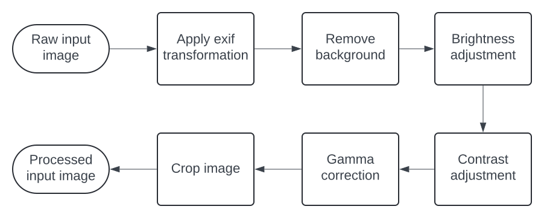

# Single view 3D reconstruction
This project focused on improving [PIFuHD](https://github.com/facebookresearch/pifuhd) reconstruction result by experimenting preprocessing images before input them into the model to make images more suitable for generation

## Recommended preprocessing pipeline


## Quick start
**Requirement**: CUDA supported GPU
**Tested machine**: 
- **Graphic card**: NVIDIA GeForce GTX TITAN X
- **CPU**: Intel Core i7-5930k 
- **Ram**: 62GB
- **OS**: Ubuntu 22.04.4 LTS
- **CUDA**: v11.5
- **Python**: v3.10.12


**Clone repository**
```bash
git clone https://github.com/RONLUG/3d-recon.git
cd 3d-recon
```

**Setup environment**
```bash
python -m venv venv
source venv/bin/activate
pip install -r requirements.txt
```

**Download pretrained models**
```bash
sh ./scripts/setup
```

**Run sample test**
```bash
sh ./scripts/sample-test
```
> For more Information about custom input, script arguments, and recommended custom preprocessing you can read in [this document](GUIDE.md)

## Suitable Input image for PIFuHD
- **Posture**
    - *A Pose* is the most successful pose for reconstruction
    - Keep fingers stick together or put hand inside pocket to avoid issue when generating individual fingers
- **Camera**
    - The optimal camera angle is parallel to the floor, with the camera locate around the middle of the model (tilted camera might cause model to porpotional incorrectly.)
    - Image should have at least 2k resolution.
- **Scene**
    - Image taken in medium light environment usually gives most satisfaction generation.
    - Avoid scene with more than 1 person inside.
